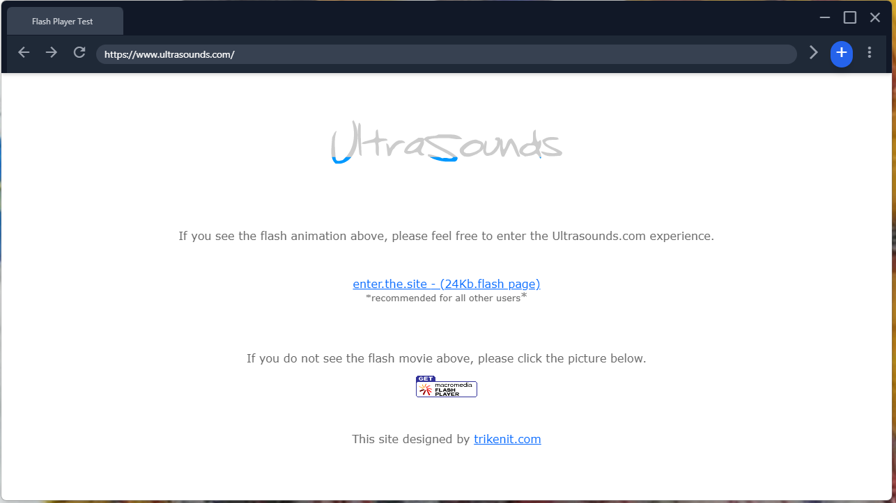
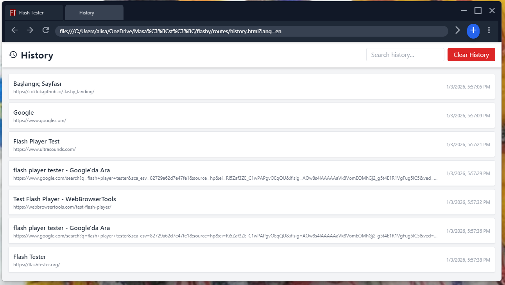

# Flashy

> **Note:** This project is currently under development.

**Flashy** is a tool designed to enable the use of an embedded Flash Player within a Chromium-based infrastructure. It allows you to run legacy Flash content seamlessly using modern browser technology.

[](https://apps.microsoft.com/detail/9NH30KB3WCPC?hl=neutral&gl=US&ocid=pdpshare)

## Supported Platforms

- ✅ **Windows** (Current)
- ⏳ **macOS & Linux** (Coming soon in future updates)

## Screenshots

| | |
|:-------------------------:|:-------------------------:|
|  |  |
|  |  |

## Table of Contents

- [Features](#features)
- [Prerequisites](#prerequisites)
- [Installation](#installation)
- [Usage](#usage)
- [Build](#build)
- [Contributing](#contributing)
- [License](#license)

## Features

- **Embedded Flash Player**: Run Flash content natively within the application.
- **Chromium Infrastructure**: Built on top of the robust and modern Chromium engine.
- **Legacy Support**: Access and interact with legacy SWF files and Flash-based websites.

## Prerequisites

Before you begin, ensure you have met the following requirements:

- **Operating System**: Windows 10 or 11.
- **Node.js**: v14 or higher.

## Installation

1. Clone the repository:

    ```bash
    git clone https://github.com/cokluk/flashify.git
    cd flashify
    ```

2. Install dependencies:

    ```bash
    npm install
    ```

## Usage

To start the application, run the following command:

```bash
# Example command
npm start
```

## Build

If you want to build the application yourself, you can use the following command:

```bash
npm run dist
```

## Contributing

Contributions are what make the open source community such an amazing place to learn, inspire, and create. Any contributions you make are **greatly appreciated**.

1. Fork the Project
2. Create your Feature Branch (`git checkout -b feature/AmazingFeature`)
3. Commit your Changes (`git commit -m 'Add some AmazingFeature'`)
4. Push to the Branch (`git push origin feature/AmazingFeature`)
5. Open a Pull Request

## License

Distributed under the MIT License. See `LICENSE` for more information.
